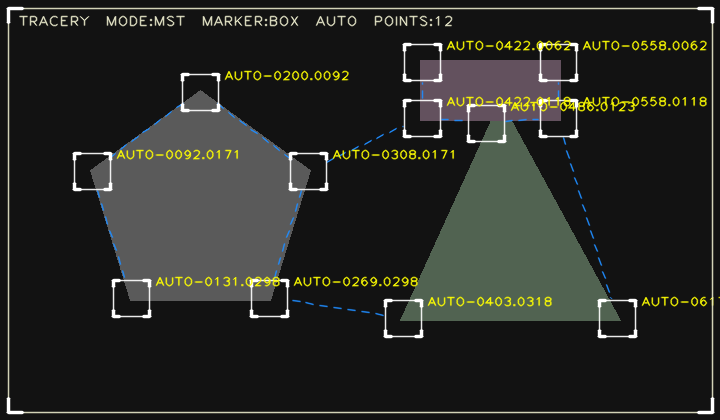

# Tracery

An open-source, OpenCV + MediaPipe recreation of the [AEScripts Tracery](https://aescripts.com/tracery/) After Effects plugin. Tracery overlays HUD-style markers and connection lines on the most distinctive points of an image, video, or live camera feed — the kind of "sci-fi targeting" graphic you see in movies.



---

## Features

- **Three input sources**: live webcam, still image, or video file
- **Automatic feature detection** using Shi-Tomasi corner detection — locks onto fingertips, knuckles, object corners, anywhere the image has a strong corner gradient
- **Manual color tracking mode**: left-click any colored region to track every blob of that color (the original Tracery workflow)
- **Four connection styles**: Sequential, Star, Full graph, and Minimum Spanning Tree (Prim's algorithm)
- **Five marker styles**: box (with corner brackets), dot, cross, plus, reticle
- **Dashed connection lines** in HUD blue with optional directional arrows
- **Yellow coordinate labels** at each tracked point
- **Hand-gesture activation** (camera mode): the effect stays dormant until you show a fully open, splayed hand to the camera — then it latches on for the rest of the session
- **Live MediaPipe hand skeleton overlay** once activated

---

## Installation

Requires Python 3.10 or newer.

```bash
git clone https://github.com/<your-username>/Tracery.git
cd Tracery

python3 -m venv .venv
source .venv/bin/activate          # on Windows: .venv\Scripts\activate
pip install -r requirements.txt
```

The MediaPipe hand-landmark model (~7 MB) downloads automatically the first time you run camera mode.

---

## Usage

```bash
python main.py
```

You'll see a menu:

```
  1) Camera (live)
  2) Image
  3) Video
  4) Exit
```

### Camera mode

1. The window opens with the plain webcam feed.
2. Show a **fully open, fingers-spread hand** to the camera. The effect activates and stays on for the rest of the session.
3. Press `g` to activate manually if hand detection isn't cooperating.

### Image mode

Enter the path to an image (you can drag-and-drop the file into your terminal). The effect runs immediately and continues to animate.

### Video mode

Enter the path to a video file. Optionally save the processed result as an `.mp4` to `output/`.

---

## Live controls

These work in any mode while the preview window is focused.

| Key | Action |
|---|---|
| `m` | Cycle connection mode: `sequential` → `star` → `full` → `mst` |
| `k` | Cycle marker style: `box` → `dot` → `cross` → `plus` → `reticle` |
| `t` | Toggle auto-detect vs manual click-to-pick color mode |
| `a` | Toggle directional arrows on connection lines |
| `l` | Toggle coordinate labels |
| `d` | Toggle dashed / solid connection lines |
| `e` | Toggle the edge-wireframe background layer |
| `+` / `-` | Marker size |
| `g` | Force-activate the effect (camera mode) |
| `s` | Save a PNG snapshot to `output/` |
| `r` | Clear all tracked color targets (manual mode) |
| `space` | Pause / resume (video mode) |
| `q` | Quit back to the menu |

In manual color mode: **left-click** any colored object to start tracking that color, **right-click** to clear all targets.

---

## How it works

| Component | Algorithm |
|---|---|
| Feature detection (auto mode) | `cv2.goodFeaturesToTrack` — Shi-Tomasi corner detection. Returns points where the image gradient is strong in two directions. |
| Color tracking (manual mode) | HSV color masking with morphological cleanup, then external contour detection and centroid computation via image moments. |
| Connection — Sequential | Chain: `p0 → p1 → p2 → ...` |
| Connection — Star | All points connect to `p0`. |
| Connection — Full | Complete graph (every pair). |
| Connection — MST | Minimum spanning tree via Prim's algorithm. |
| Hand detection | MediaPipe Hand Landmarker (21 keypoints per hand). "Open hand" = all four non-thumb fingers extended **and** fingertip spacing ≥ 1.35× knuckle spacing. |
| Edge overlay | Canny edge detector, tinted and composited at low intensity. |

---

## Project structure

```
Tracery/
├── README.md
├── LICENSE
├── requirements.txt
├── .gitignore
├── main.py                     # menu loop and per-mode runners
├── docs/
│   └── preview.png
└── tracery/                    # importable Python package
    ├── __init__.py             # re-exports TraceryEffect, HandDetector
    ├── effect.py               # core Tracery effect (detection, drawing, HUD)
    └── hand_detector.py        # MediaPipe wrapper + open-hand gesture check
```

You can also use the effect programmatically:

```python
import cv2
from tracery import TraceryEffect

effect = TraceryEffect(connection_mode="mst", marker_style="box")
frame = cv2.imread("photo.jpg")
out = effect.process(frame)
cv2.imshow("Tracery", out)
cv2.waitKey(0)
```

---

## Tuning

Most behavior is controlled by keyword arguments to `TraceryEffect(...)`:

| Argument | Default | Effect |
|---|---|---|
| `auto_max_points` | `24` | Cap on tracked points in auto mode. |
| `feature_quality` | `0.04` | Lower = catches weaker corners. |
| `feature_min_distance` | `40` | Minimum pixel spacing between detected corners. |
| `marker_size` | `18` | Half-side of the box / radius of the reticle, in pixels. |
| `line_color` | `(255, 140, 30)` | BGR color of connection lines. |
| `label_color` | `(0, 255, 255)` | BGR color of coordinate labels. |
| `dim_background` | `0.45` | How much to darken the source frame (0 = black, 1 = original). |
| `dash_length` / `dash_gap` | `8` / `6` | Dash pattern in pixels. |

For the hand detector:

```python
from tracery import HandDetector
detector = HandDetector(spread_threshold=1.5)   # stricter open-hand requirement
```

---

## Credits

- Visual concept based on the commercial [AEScripts Tracery](https://aescripts.com/tracery/) plugin for After Effects.
- Hand tracking powered by [Google MediaPipe](https://developers.google.com/mediapipe).
- Built on [OpenCV](https://opencv.org/) and [NumPy](https://numpy.org/).

---

## License

MIT — see [LICENSE](LICENSE).
